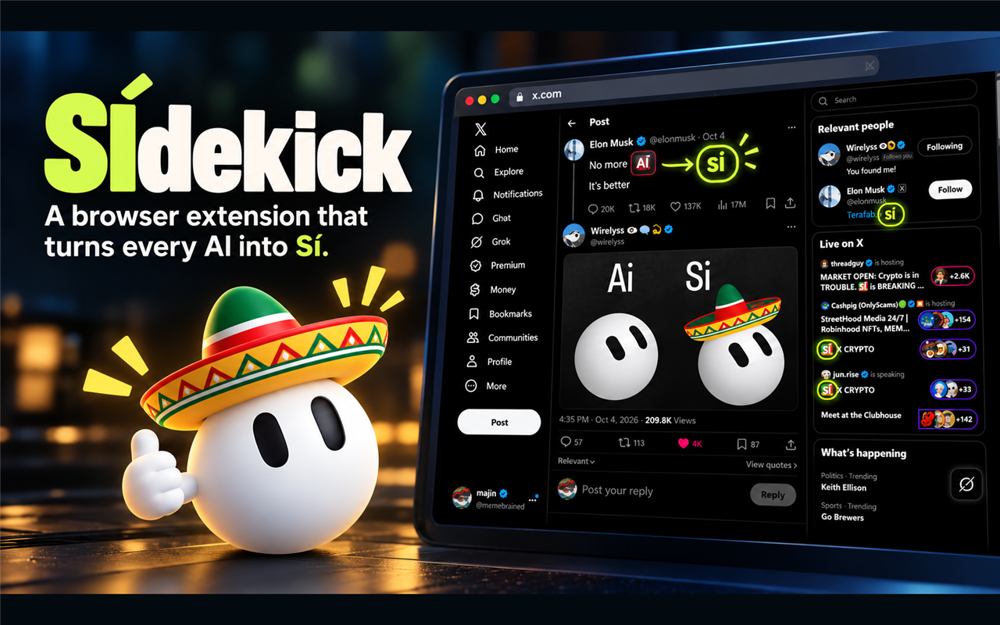
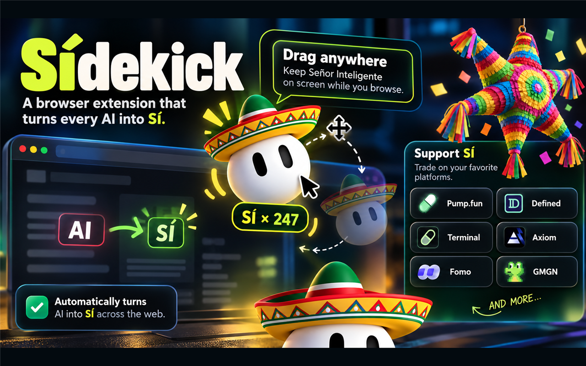

# SIdekick — powered by Señor Inteligente

SIdekick is a playful Chrome companion that transforms visible standalone occurrences of **AI** into **SÍ** on the webpage you activate. It includes Señor Inteligente’s mascot, optional effects, a local transformation counter, and public `$Sí` market information.

[Visit the SIdekick website](https://sidekick-si.vercel.app)



## ✨ Features

- User-activated AI → SÍ transformation
- Draggable Señor Inteligente mascot
- Tappable piñata and optional confetti
- Local transformation counter
- Dark and light modes
- Popup and persistent side panel
- Public DexScreener and GeckoTerminal market information
- User-initiated links to supported trading platforms

Some trading-platform buttons contain referral links. SIdekick does not connect to wallets, execute trades, access private keys, or automatically open external destinations.



## 📦 Install manually

Until the Chrome Web Store listing is approved, you can install the extension directly from this repository:

1. Download the clean manual-install ZIP from the [latest GitHub release](https://github.com/memebrained/Sidekick/releases/latest). Alternatively, select **Code → Download ZIP** to download the repository source.
2. Extract the downloaded ZIP to a permanent folder. Do not delete that folder after installation.
3. Open `chrome://extensions` in Chrome.
4. Enable **Developer mode** in the upper-right corner.
5. Select **Load unpacked**.
6. Choose the extracted folder containing `manifest.json`.
7. Pin SIdekick from Chrome’s Extensions menu if you want easy access.

Chrome may disable manually installed extensions if their files are moved or deleted. To update a manual installation, download the newest repository version, replace the extracted files, and select **Reload** on the `chrome://extensions` page.

## 🪅 Using SIdekick

Visit an ordinary `http://` or `https://` webpage and open SIdekick from the Chrome toolbar. This explicit action grants temporary access to the current page and activates the text transformation, mascot, and selected effects. SIdekick does not request permanent access to every website.

Chrome internal pages, the Chrome Web Store, and certain other protected pages do not allow extension injection.

## 🔒 Privacy

Webpage processing happens locally after the user activates SIdekick on the current page. Visible webpage text is not retained or transmitted to MemeBrain. Preferences and counters are stored locally through Chrome extension storage.

See the full [Privacy Policy](PRIVACY_POLICY.md).

## 🪙 Token

**Señor Inteligente (`$Sí`)**

Solana contract:

```text
1BYFCLiArGnZA6GHXro8WhGX4n1hWk2mwrxbnMY9emN
```

[View on Pump.fun](https://pump.fun/coin/1BYFCLiArGnZA6GHXro8WhGX4n1hWk2mwrxbnMY9emN)

Market information is informational, may be delayed, and is not financial advice. Always verify the contract address and destination before trading.

## 🌵 Credits

- Extension by [Majin / MemeBrain](https://x.com/memebrained)
- Original meme by [Wirelyss](https://x.com/wirelyss)

## 💚 Support the project

If SIdekick makes you smile, you can support future development with an optional Solana donation:

```text
FEUPKL7a6bUqxnyXzuvWqX3b9Hj6JhTHTse27URax58s
```

